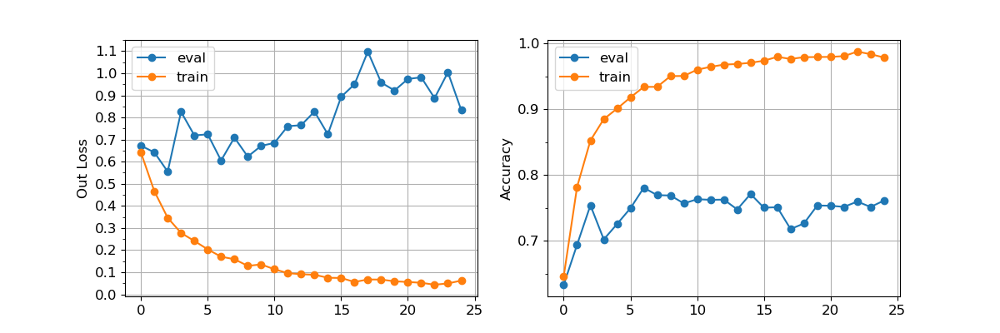
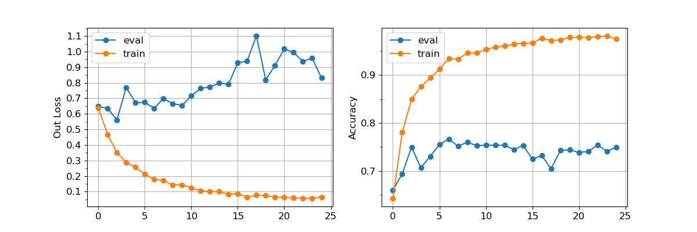
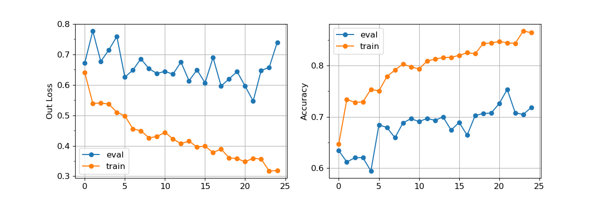

# Decoder

Standard:

Decoder:

Decoder_Async:

I tried to adapt the idea of GAN to this classification problem, but it didn't work in my implement.

The reason why I tried this method is the confusion matrices always shows high `TP` rate but low `TN` rate, which made me think the model has no ability to distinguish forgery faces from authentic faces, but only remembering the finite authentic face-environment combination. Remembering the authentic data may be easier than find forgery clue for the model, thus it chose the former method to complete the mission.

I constructed an autoencoder with original classification model structure. To specify, I used the intermediate output of the FC layer after backend as code, and added an image decoder utilizing this code. Then I referred GAN's idea, and set two losses:

* The original model should be able to classify forgery face and authentic face.
* The code should contain as less info as possible to avoid overfitting. So the backend and the FC layer before decoder should try their best to avoid reconstruction of original image.

I tried typical GAN's training method, which is update decoder and classifier's weights each iteration, but it seemed that the decoder needs way more iteration to learn due to the variational code distribution. This is also the reason why the `Decoder` fig is very similar to the `Standard` fig, it implies that the Decoder method didn't influence much to the training process, neither to the classifier's weights.

With the result analyzed, I tried a different training approach:

1. Train classifier for a few iteration (like 1/10 epochs)
2. Pause training process of classifier, train decoder for a few epochs (1 or 2 epochs)
3. Train classifier with decoder loss to avoid reconstruction for a few iteration (like 1/10 epochs)
4. Go to process (2)

It's easy to see that this attempt also failed from the `Decoder_Async` fig, because this approach only slowed down the training process (quite a lot), but didn't alleviate overfitting.
