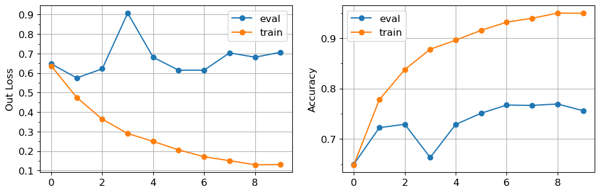
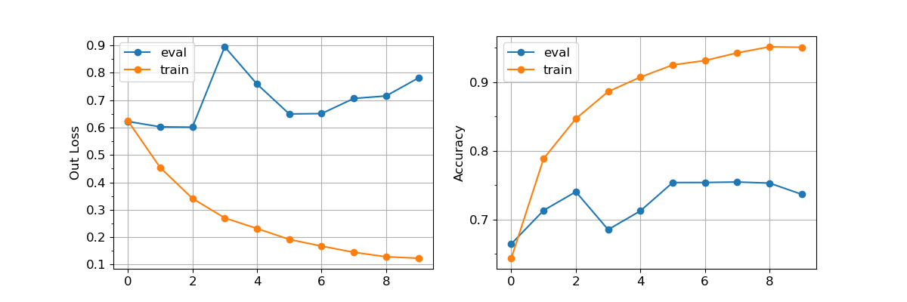
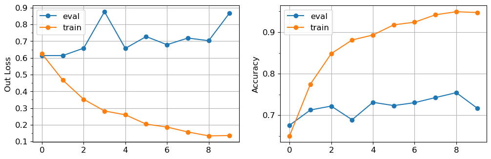

# Layer Width

## Result

Results on 512-dim, 256-dim, 128-dim:



<center><small>512-dim</small></center>



<center><small>256-dim</small></center>



<center><small>128-dim</small></center>

According to the figures, it's obvious that 512-dim layer width fits the dataset better, and it's even more consistent in loss, which may alleviate overfitting.

## Model Structure

Model structure below is used in finding best setup.

```python
class GazeForensics(nn.Module):
    def __init__(self, save_gaze_out=False, leaky=0, gaze_emb_dim=256):
        nn.Module.__init__(self)

        self.save_gaze_out = save_gaze_out
        
        dim_per_head = 32
        head_num = 4

        self.leaky = leaky
        self.avg_dim = 512
        self.emb_dim = gaze_emb_dim + leaky
        self.MHA_dim = head_num * dim_per_head
        self.MHA_comp_dim = 64
        self.fpc = 14 # frames per clip
        self.gaze_out = None
        self.softmax = nn.Softmax(dim=1)

        self.base_model = resnet18(pretrained=True)

        self.multihead_attn = nn.MultiheadAttention(self.MHA_dim, head_num, batch_first=True)
        self.MHA_comp = FC_block(self.MHA_dim, self.MHA_comp_dim, mid_sizes=[
            self.MHA_comp_dim,
            self.MHA_comp_dim
        ])
        last_fc_input_size = self.MHA_comp_dim * self.fpc
        self.last_fc = FC_block(last_fc_input_size, 3, mid_sizes=[
            last_fc_input_size // 2,
            last_fc_input_size // 4,
        ])

        # parameter 'leaky' will change the neron number of gaze_fc layer,
        # to minimize the influence on other layers within a fixed seed,
        # we initialize gaze_fc layer after other layers have been initialized.
        self.gaze_fc = FC_block(self.avg_dim, self.emb_dim, mid_sizes=[self.emb_dim])
        self.MHA_Q_fc = FC_block(self.emb_dim, self.MHA_dim, mid_sizes=[self.MHA_dim, self.MHA_dim])
        self.MHA_K_fc = FC_block(self.emb_dim, self.MHA_dim, mid_sizes=[self.MHA_dim, self.MHA_dim])
        self.MHA_V_fc = FC_block(self.emb_dim, self.MHA_dim, mid_sizes=[self.MHA_dim, self.MHA_dim])


    def forward(self, x):
        batch_size = x.size(0)
        x = self.base_model(x.view((batch_size * self.fpc, 3) + x.size()[-2:]))
        x = x.view(batch_size, self.fpc, self.avg_dim)
        x = self.gaze_fc(x)
        if self.save_gaze_out:
            self.gaze_out = x[:, :, :self.emb_dim-self.leaky]
        
        q, k, v = self.MHA_Q_fc(x), self.MHA_K_fc(x), self.MHA_V_fc(x)
        x, _ = self.multihead_attn(q, k, v)

        x = x.reshape(batch_size * self.fpc, self.MHA_dim)
        x = self.MHA_comp(x)
        x = x.reshape(batch_size, self.fpc * self.MHA_comp_dim)
        x = self.last_fc(x)
        x[:, :2] = self.softmax(x[:, :2])

        return x
```

## Config

```python
train_DS_name = 'WDF'
test_DS_name = 'WDF'

standard_transform = transforms.Compose([
transforms.Resize((224,224)),
transforms.ToTensor(),
transforms.Normalize(mean=[0.485, 0.456, 0.406], std=[0.229, 0.224, 0.225])
])


params_basic = { # Fundamental parameters
'rootDir': rootDir,
'train_DS_name': train_DS_name,
'test_DS_name': test_DS_name,
'checkpointDir': 'Checkpoints/',
'tryID': 'Standard', # If None, tryID will be set to the current time
}
params_model = { # Parameters that controls model
'checkpoint': None, # None stands for init a new model, otherwise load the model from the path
'seed': 64, # This seed if for initializing the model
'leaky': 0, # How many dimensions to expand on gaze embedding
'emb_dim': 256, # Dimension of gaze embedding
}
params_opti = { # Parameters that controls optimizing, loss, scheduling.
'lr': 1e-5,
'weight_decay': 1e-5,
'step_size': 1,
'gamma': 0.95,
}
params_loss = { # Parameters that controls loss
'loss_func': 'standard', # Either 'standard' or 'custom'
'bonus_weight': 0,
'FN_w': 1, # False negative weight in custom loss
'FN_bound': 0.6, # False negative boundary in custom loss
'gaze_weight': 0,
#   'gaze_weight' decides whether to use gaze info or not
#   because final_loss = output_BCE_loss + gaze_weight * gaze_MSE_loss
#   if gaze_weight is 0, the model will not use gaze info
}
params_prep = { # Parameters that controls preprocess
'thread_num': 4, # Note that different thread_num will lead to different result in dataset clipping
'util_percent': 0.1, # utilization percentage of the dataset
'tempDir': rootDir + 'temp/', # 'tempDir' is the directory to store clipped train dataset
'prep_every_epoch': True,
#   True or False
#   Due to the randomness of the dataset clipping process,
#   preprocess the dataset every epoch may alleviate overfitting
'save_dataset': True, # True or False, this is useful when trying to find the best hyperparameters
'transform': standard_transform,
'trainCateDictDir': rootDir + 'clip_info/' + train_DS_name + '_vid_category_dict.json',
}
params_test = { # Parameters that controls test process
'enable': True, # True or False
'level': 'clip',
#   Either 'clip' or 'video'
#   'clip':
#       Gen test DS by randomly select clips.
#       If 'util_percent' < 1,
#       will try to make dataset contains equal amount of clips from all videos.
#   'video':
#       Gen test DS by randomly select videos.
#       If 'util_percent' < 1,
#       some videos in the DS will not be used at all.
'batch_size': 16,
'num_workers': 4,
'util_percent': 0.25, # utilization percentage of the dataset
'testClipsDir': rootDir + 'clipped_videos/' + test_DS_name + '_clip/',
'resultDir': 'Results/',
}
params_train = { # Parameters that controls train process
'enable': True, # True or False
'num_epochs': 10,
'batch_size': 16,
'num_workers': 4,
'seed': 64, # This seed if for the random shuffle of the dataset in training
}
```

